# DagVersary_Builder
## Making it easier to build and export adversaries and environments
This is a locally-hostable Shiny app to set up and run adversaries for the Daggerheart TTRPG; while it requires a version of R installed on your computer and a handful of R packages to run (see the 'Running this App Locally' section under the 'App Structure' section), once you have a copy of the program on your computer it's yours to use at your leisure. 

Users can select how many of each type of adversary they want (including colossal adversaries!) on the 'Start' tab, head to 'Customize' to add specific details (including auto-populate some features), then either run an encounter using the 'Run' tab (e.g. adjust HP/Stress/conditions) OR output the customized stat blocks in a template that will work with either the Daggerforge plugin (one tab) or the Obsidian (ITS Theme) (another tab) to run encounters there.

This README covers the app's structure and launching the app locally from your computer.

## App Structure

The app has the following structure, organized by tab:

### Start
Start here - specify the party size (if following the 'Battle Points' guidance from the core rules), the challenge type, and the count for each adversary type (including Colossi!)

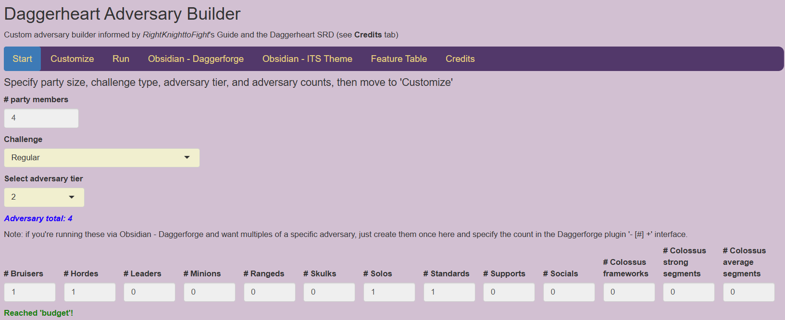

### Customize 
Fill in details for your adversaries (name, motives & tactics, weapon name, experiences, features) and tweak the default values for HP/stress/damage (following RightKnighttoFight's guidelines - see "Credit" tab). Optionally, populate adversaries with randomly-generated Passive/Action/Reaction features that are sensible for that adversary type (also listed in the 'Feature Reference' tab)

- ***Caution:** If you decide to go back to the 'Start' tab and change details, the 'Customize' tab will reset, potentially losing your previously-entered details.*

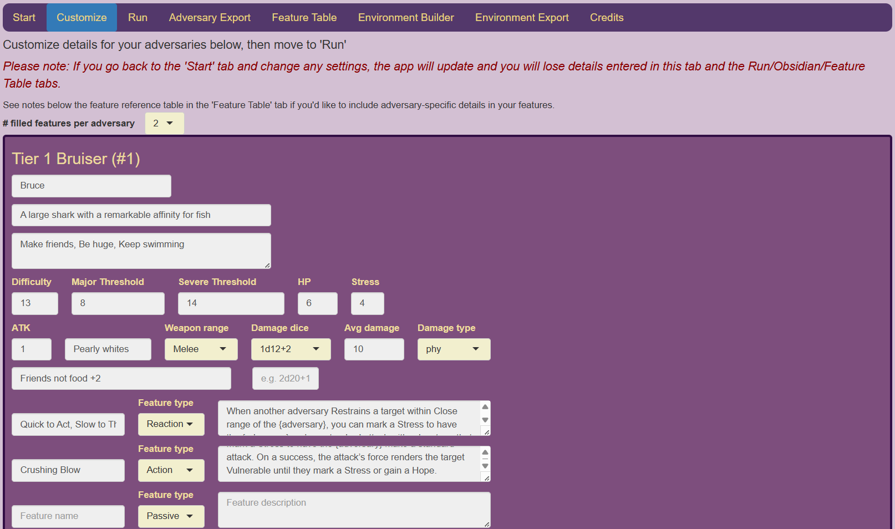

- ***BONUS:*** The app supports dynamic feature details that let you do things like scale a feature's damage dice or dice count with the tier you selected - there are notes with details on how to use that toward the bottom of the 'Feature Table' tab.
 
### Run 
Optionally run your encounter from here! Basic conditions and messages for emptied-Stress and -HP adversaries help you keep track of things.

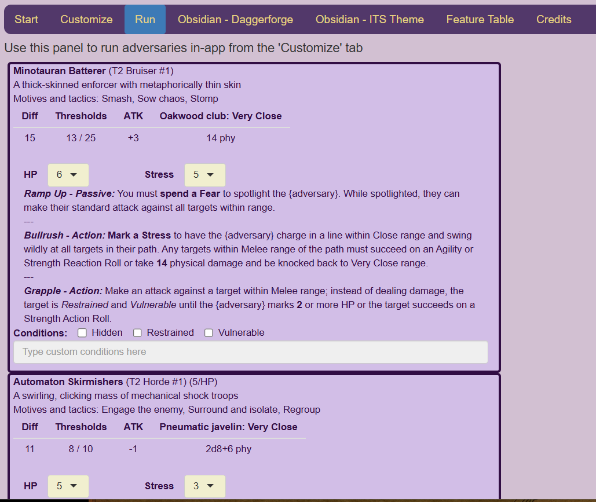

- This is more a 'bonus, potentially useful' feature - the next tab covers exporting adversaries for use in the Obsidian application, which is probably a better program to use to run these adversaries. Obsidian is also a great note-taking app, so you'd be able to run adversaries in a given session's note rather than clicking between this program and your notes.

### Adversary Export: Obsidian - Daggerforge
Export a JSON file to your Downloads folder to upload and run your custom adversaries using the Daggerforge plugin in Obsidian.

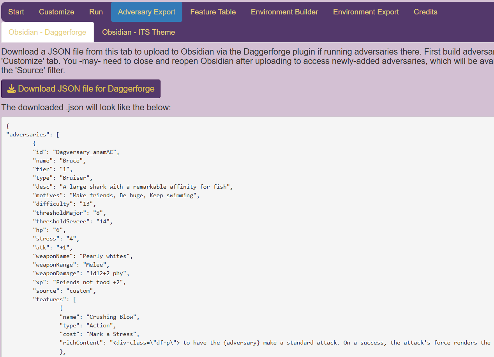

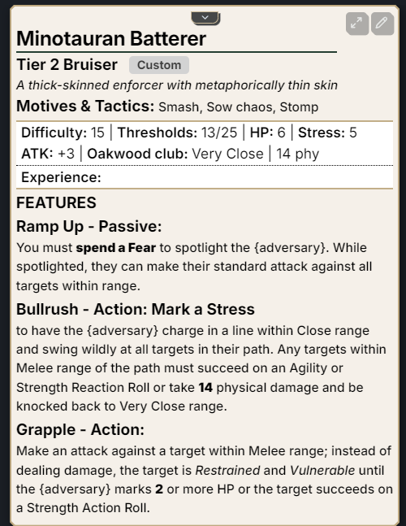
  
- Once you've set up your adversaries in the Customize tab, you can click the 'Download JSON file for Daggerforge' to send a JSON file to your Downloads folder - you can directly upload this into Daggerforge if you have that plugin set up. The tab also shows a preview of what the JSON file will look like below the button.

### Adversary Export: Obsidian - ITS Theme Markdown
Export a .txt file to your Downloads folder to copy-paste into your Obsidian vault with the ITS Theme plugin installed. While it _can_ also work in Obsidian without the plugin, the end result doesn't look great.

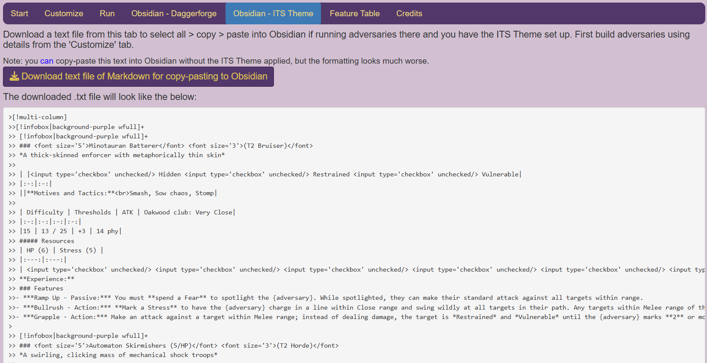

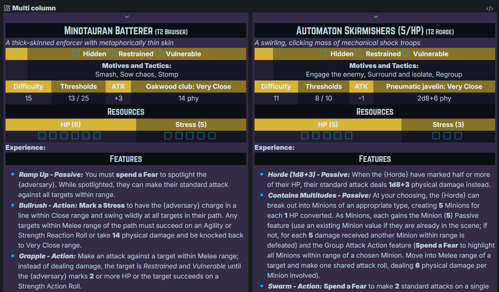

- Again, this will work once you've set up adversaries in the Customize tab; technically once you have any adversaries selected in the Start tab, but key details will be empty - so not recommended to launch from there! As with the 'Daggerforge' tab there's a preview of the content below the download button, so you could select from there any copy into Obsidian if you wanted. I haven't figured out how ot get 'select all' to only select content in the window, so you may be scrolling for a while to highlight everything - it'll likely be faster for you to download the .txt file and then select-all > copy > paste from there. 

### Feature Table 
See a listing of the available features per adversary (some are from the SRD, others are an attempt at 'generic but not boring' features that align with the adversary type), plus some 'general use' features you might consider copying into the 'Feature' fields for your adversaries. 'General use' features do *not* automatically populate the Feature listings as combinations of these can create overly-tough adversaries (e.g. resistance to both physical AND magic damage).

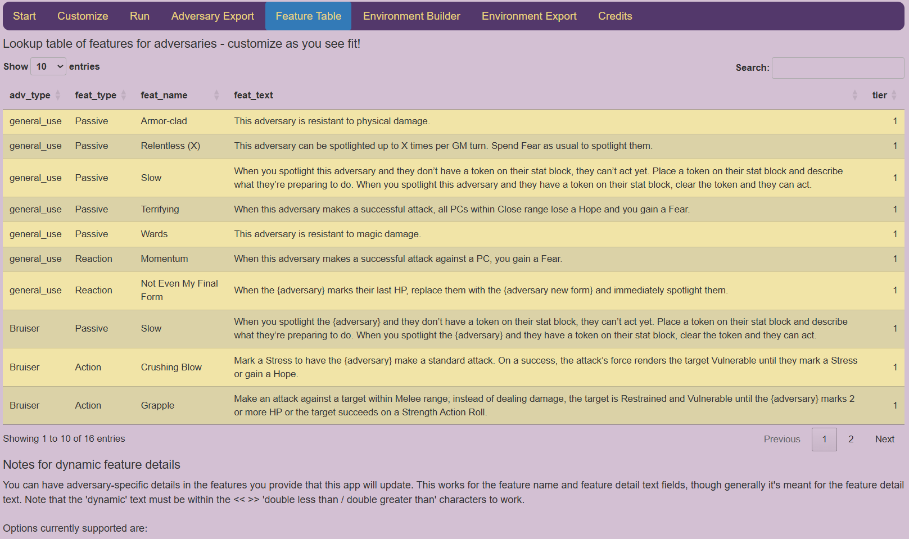

- As mentioned above, this tab also has notes beneath the Feature Table on including feature details the app can work with to have dyanmic features that can update to reflect the adverary or tier's values. As an example a feature with "<<1.5x dmg +3>>" in the feature description will replace that text with the combination of dice {count}d{sides} and the +/- modifier that gives an expected value close (or matching!) one-and-a-half times (plus three) the expected value of the adversary's 'standard attack' damage dice. If you selected 'Use Avg' for that adversary to use a fixed number for that damage, the text will be replaced with the calculated value, rounded up to the nearest whole number.

### Environment Builder

You can also create custom environments for export to Obsidian and use in either the Daggerforge plugin or in Obsidian with the ITS Theme.
First specify the tier of interest in the 'Counts by Type' sub-tab, then add details in the 'Customize' sub-tab. You can optionally reference the 'Notes' sub-tab for environment elements to consider and notes for different countdown types and related wording to ensure the exported environments have good formatting.

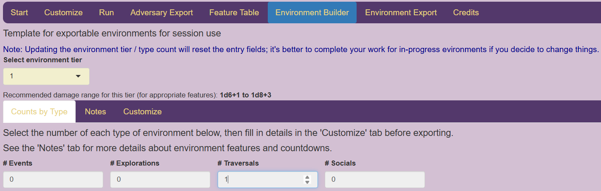

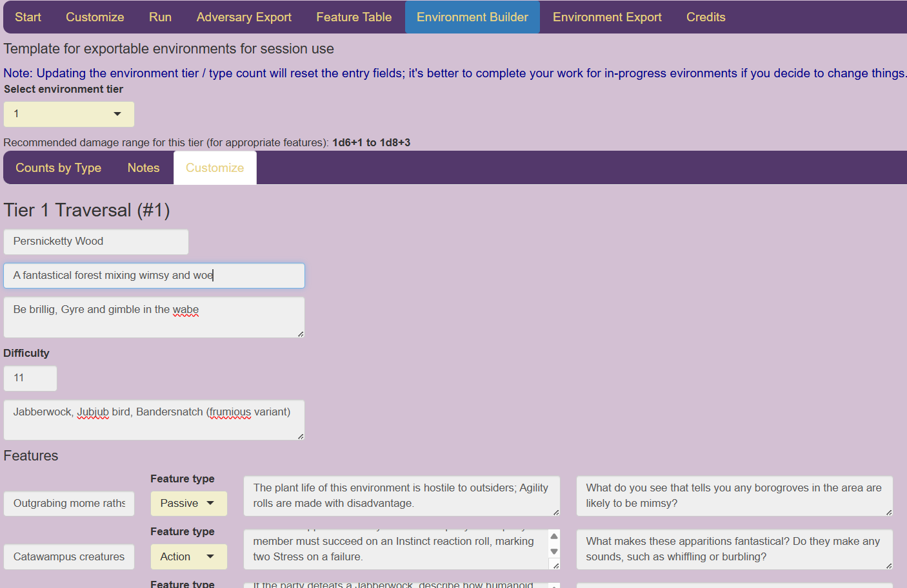

### Environment Export - Obsidian-Daggerforge and Obsidian-ITS Theme

The same export options for Adversaries are available for Environments.

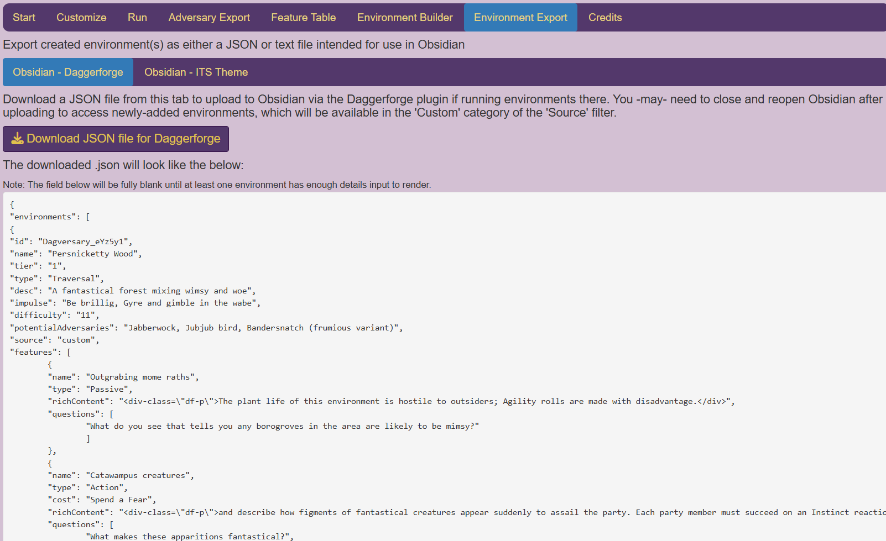

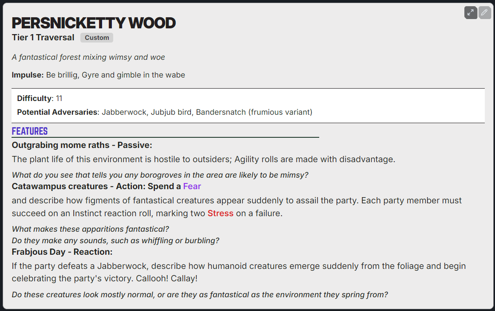

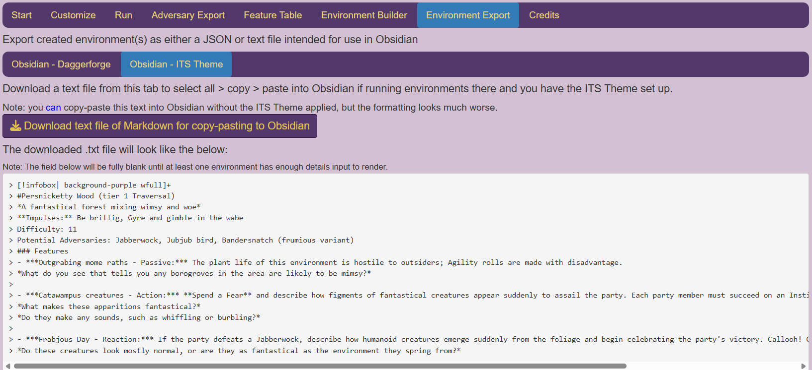

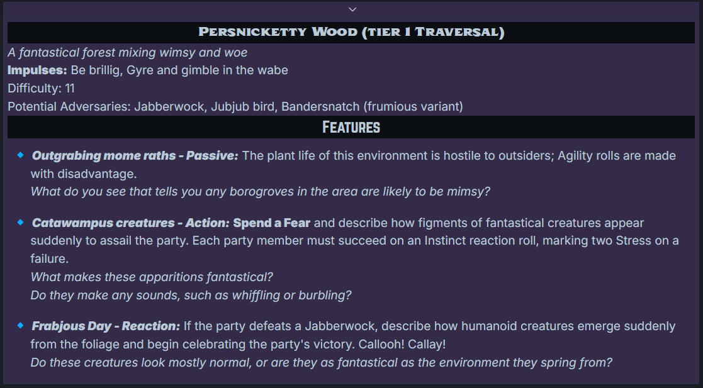

### Credits
This app wouldn't have gone anywhere without the fantastic efforts of the following folks, also noted in the 'Credits' tab:

- Darrington Press (naturally!) for creating Daggerheart and the SRD; as noted in the Credits tab, this application includes materials from the Daggerheart System Reference Document 1.0, © Critical Role, LLC. All rights reserved.

- Starting values and recommended ranges for each adversary's numeric stats (Difficulty, Thresholds, HP, Stress, Attack modifier, Damage dice, and Average damage) come from RightKnighttoFight’s Guide to Making Custom Adversaries v1.6 ; the Credits tab links to the Heart of Daggers and Drive Thru RPG listings for this Guide.

- A neat pair of features to dynamically move between Minions and Hordes (e.g. split out a Horde to create Minions, or merge Minions into a Horde) is heavily inspired by a Reddit post by user ThatZeroRed.

## Running this App Locally
This app is hosted remotely via Posit Connect Cloud [Link to Posit Cloud version of the app](https://anutandastone-dagversary-builder.share.connect.posit.cloud/), but using a free account that only supports 20 'active hours' (hours someone is using the app) per month. That said, this app is pretty lightweight (size on disk about 150 KB for my Windows PC) and can be run easily from your PC with no need for the remotely-hosted program.

### Requirements to Run This App Locally (using only R)

- A version of R (recommend using version 4.5.0 or newer); this is a free an open source programming language used for statistical computing. You can download a copy from the [Comprehensive R Archive Network](https://cran.r-project.org/).

- *Note: If you're interested in working with R I highly recommend also installing an interactive development environment (IDE) program, like Posit RStudio or Positron, as I find it greatly improves the process. That said, the rest of this section assumes you're just running this in the standalone R environment, which is totally doable since you'll only need a few packages (basically bundles of code someone else has written and is sharing) and a few lines of code to run everything.*

- Once you've installed and opened R, you'll need to install some R packages so the code that underpins the app will be available for your use. Sometimes packages have 'dependencies' (code provided by a different package), so you may get a warning or error message that 'package {package name here} is not available' - in that case you would need to also install the {package name here} package. Packages can be installed in R by typing `install.packages("PACKAGE")` (replace 'PACKAGE' with the name of the package of interest) and hitting 'enter'; if you want to allow any dependency packages to also be installed, you can use `install.packages("PACKAGE", dependencies = TRUE)` instead. That will then launch the installation process for the given package (and potentially any packages that package depends upon). If you want to install multiple packages in one go, you can combine package names with `c()` as shown here: `install.packages(c("PACKAGE1", "PACKAGE2"))`.

-  The following packages are needed to run this app; note that R is case-sensitive so lowercase/uppercase text is different:
    + **shiny** (most of the app is written in R code; the `shiny` package provides R functions that build HTML and JavaScript for an interactive web page for the end user)
    + **dplyr** (part of the `tidyverse` set of packages, `dplyr` provides functions that make it easier to work with data and multi-step processes)
    + **stringi** (some of the trickier bits of the 'dynamic feature' functionality of this app require `stringi` to identify the right parts of the feature text that need replacement and to swap in the right details)
    + **DT** (the `DT` package provides a lot of functionality to the 'Feature Table' tab's feature table)
    + If I'm reading the `DT` package's documentation correctly, it requires the following packages as dependencies: `crosstalk` (provides HTML widget functionality), `htmltools` (more HTML functionality), `htmlwidgets` (say it with me: HTML functionality), `jquerylib` (pretty sure this is used to let you search/filter the feature table), `jsonlite` (used for working with JSON files, so likely processing for the underlying feature data.frame object), `magrittr` (provides function operators that let you combine code operations like "filter this data.frame to a subset that matches THIS condition, and then {do something else with the result}"), and `promises` (lets your code work with data objects that might be generated at different times - this keeps the the process of working with the feature table, like that filtering example, working smoothly)

- Hopefully at this point you've successfully installed R and those packages are all sitting cozy in your computer. The hard part's over!

- Now to run the app locally, you just need two things: 1) the location in your computer where you've stored a copy of all the files inside the 'DagVersary_Builder' folder here on GitHub (PLEASE keep the same file structure - it's likely to cause no end of annoyance if you move things around) and 2) your R program fired up.

- For 1), download a copy of the DagVersary_Builder folder and its contents to wherever you'd like it in your computer

- For 2), open your R program and run the following line of code, changing the PATH TO WHERE THE APP FOLDER IS STORED part to fit for your computer: `shiny::runApp(appDir = "PATH TO WHERE THE APP FOLDER IS STORED/DagVersary_Builder")`

- As an example (that likely won't work as-is for you, sorry!), if your copy of the 'DagVersary_Builder' folder is in your "C:\Documents\Daggerheart" folder, you'd use `shiny::runApp(appDir = "C:/Documents/Daggerheart/DagVersary_Builder")` - note that the '\\\' backslashes provided by most(?) computer file paths need to swap to '/' forward slashes to work in R...for reasons that elude and mystify me.
    + The REAL reason may be because some programming languages, and R is one of these, use '\\\' as an 'escape' character for certain operations; not going to fully open that can of worms, but basically the program gets its instructions from the text we give it and the escape character lets the program successfully work with that character for instructions - the markdown file I'm writing this README in needs three backalashes to show a single \\\, for example.

- And that's all there is to it! You can close the resulting browser page that opens when you're done using the app, and you can close out the R program when you're done with that. If you get any messages asking if you want to save your R environment or anything to do with the app, feel free to click 'No' or otherwise ignore and close out the program - R has a tendency to want to keep things 'as is' from one session to the next (e.g. storing the 'session state' like what code commands you've given it), but there's nothing here that 'breaks' or otherwise should give you any grief if you don't save it.
